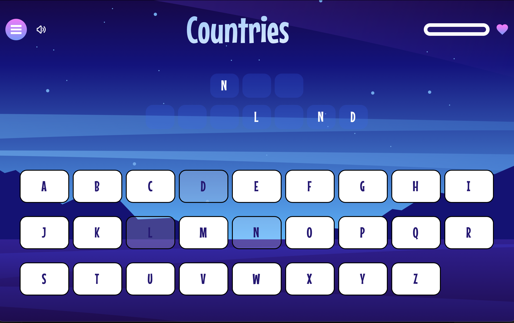

# Frontend Mentor - Hangman game solution

This is a solution to the [Hangman game challenge on Frontend Mentor](https://www.frontendmentor.io/challenges/hangman-game-rsQiSVLGWn). Frontend Mentor challenges help you improve your coding skills by building realistic projects.

## Table of contents

- [Overview](#overview)
  - [The challenge](#the-challenge)
  - [Screenshot](#screenshot)
  - [Links](#links)
- [My process](#my-process)
  - [Built with](#built-with)
  - [What I learned](#what-i-learned)
  - [Technical Highlights](#technical-highlights)
  - [Useful resources](#useful-resources)
- [Author](#author)

## Overview

### The challenge

Users should be able to:

- Learn how to play Hangman from the main menu.
- Start a game and choose a category.
- Play Hangman with a random word selected from that category.
- See their current health decrease based on incorrect letter guesses.
- Win the game if they complete the whole word.
- Lose the game if they make eight wrong guesses.
- Pause the game and choose to continue, pick a new category, or quit.
- View the optimal layout for the interface depending on their device's screen size.
- See hover and focus states for all interactive elements on the page.
- Navigate the entire game only using their keyboard.

### Screenshot



### Links

- Solution URL: [https://github.com/Chious/fm-hangman-game](https://github.com/Chious/fm-hangman-game)
- Live Site URL: [https://hangman-game-3c1.pages.dev](https://hangman-game-3c1.pages.dev)

## My process

### Built with

- **[Astro](https://astro.build/)** - Static Site Generator with View Transitions
- **[React](https://reactjs.org/)** - For interactive components
- **[Nanostores](https://github.com/nanostores/nanostores)** - Tiny state manager (286 bytes)
- **[Tailwind CSS](https://tailwindcss.com/)** - Utility-first CSS framework
- **TypeScript** - Type-safe development

### Process

1. Set up page layout and global styles.
2. Implement game state with Nanostores in `@atom/game.ts`.
3. Improve UI, keyboard support, and sound effects for better user experience.

### What I learned

1. The most challenging part of this project was working with uncommon styles that required individual definitions, such as multiple borders for the navbar background or custom fonts.

```css
/* typography */
.text-preset-1 {
  font-size: var(--text-preset-1-font-size);
  font-family: var(--text-preset-1-font-family);
  font-weight: var(--text-preset-1-font-weight);
  font-style: var(--text-preset-1-font-style);
  letter-spacing: var(--text-preset-1-letter-spacing);
  line-height: var(--text-preset-1-line-height);
  text-transform: var(--text-preset-1-text-case);
}

@theme {
  /*Inner Shadow*/
  --shadow-inner-bg: inset 0 -8px 0 4px #140e66, inset 0 6px 0 8px #2463ff;
  --shadow-inner-btn: inset 0 -4px 0 4px #243041, inset 0 -12px 0 11px #9d2df5;
  --shadow-inner-btn2: inset 0 -2px 0 3px #140e66, inset 0 1px 0 8px #3c74ff;
}
```

I also used `clamp()` to handle responsive size changes:

```css
--font-size-preset-1: clamp(4rem, 2rem + 8vw, 8.5rem);
```

#### Cross-Page State Preservation with View Transitions

> At first attempt, I used `window.location.href` to switch pages

```astro
---
const handleCategoryPick = (category: string) => {
  categoryAtom.set(category);
  window.location.href = "main";
};
---

<button onClick={handleCategoryPick}>Movies</button>
```

However, I found that states in atoms would be destroyed when pages reload, since the game is controlled across different pages:

1. Home Page
2. Category Selection Page - User can choose a category, which picks a random `quizAnswer` and updates `gamePhase`
3. Game Page - Handles more complex user events and compares them with `quizAnswer`

**Solution:** Astro's View Transitions API enables client-side navigation, keeping the JavaScript environment alive and preserving Nanostores state in memory. It also makes page transitions animate more smoothly.

> Reference: [View Transition: Maintain State](https://docs.astro.build/en/guides/view-transitions/)

```astro
---
import { ClientRouter } from "astro:transitions";
---

<link rel="icon" type="image/svg+xml" href="/favicon.svg" />
<meta name="generator" content={Astro.generator} />

<!-- Primary Meta Tags -->
<title>{title}</title>
<meta name="title" content={title} />
<meta name="description" content={description} />

<ClientRouter />
```

Then implement `onClick` with:

```typescript
// src/components/CategoryPicker.tsx
import { navigate } from "astro:transitions/client";

const handleCategoryPick = (category: string) => {
  categoryAtom.set(category);
  navigate("main");
};
```

**Why it works:**

- View Transitions intercepts link clicks
- Fetches new page content via `fetch()`
- Updates DOM without reloading JavaScript
- Nanostores atoms remain in memory

---

### Technical Highlights

#### Game Logic Architecture

All game logic is centralized in `gameAtoms.ts`, following the principle of separating business logic from UI components:

```typescript
export function handleLetterPick(letter: string) {
  const normalizedLetter = letter.toLowerCase().trim();

  // Ignore if letter already chosen
  const currentChosen = chosenLettersAtom.get();
  if (currentChosen.has(normalizedLetter)) return;

  // Add letter to chosen set
  const newChosen = new Set(currentChosen);
  newChosen.add(normalizedLetter);
  chosenLettersAtom.set(newChosen);

  // Check if letter is in answer
  const answer = answerAtom.get().toLowerCase();
  const isCorrect = answer.includes(normalizedLetter);

  if (!isCorrect) {
    // Wrong guess - decrease HP
    const currentHp = hpAtom.get();
    const newHp = Math.max(0, currentHp - 1);
    hpAtom.set(newHp);

    if (newHp === 0) {
      gamePhaseAtom.set("lose");
    }
  }

  checkWinCondition();
}
```

**Tips:** In a real project, game logic should always be controlled by the server. See: [Chious/kaplay-colyseus](https://github.com/Chious/kaplay-colyseus/blob/main/server/src/rooms/MyRoom.ts), which is forked from the official tutorial from [colyseus/kaplay](https://github.com/colyseus/kaplay)

#### Avoiding Hydration Mismatches

Game state is controlled by user events, so I use `client:only="react"` to render components only on the client side, avoiding SSR hydration mismatches:

```astro
<!-- src/pages/main/index.astro -->
<PickAlphabetSection options={alphabet} client:only="react" />
<AnswerSection client:only="react" />
<GameNavbar isHPVisible={true} client:only="react" />
```

---

## Useful resources

- **[Nanostores Documentation](https://github.com/nanostores/nanostores)** - Essential guide for understanding how Nanostores stores state in JavaScript closures and manages subscriptions.
- **[Astro View Transitions Guide](https://docs.astro.build/en/guides/view-transitions/)** - Comprehensive documentation on enabling client-side navigation to preserve JavaScript state across page transitions.
- **[@nanostores/react](https://github.com/nanostores/react)** - React integration for Nanostores, providing the `useStore()` hook for reactive components.
- **[Astro Client Directives](https://docs.astro.build/en/reference/directives-reference/#client-directives)** - Understanding `client:only`, `client:load`, and other directives for controlling component hydration.

## Key Takeaways

1. **Nanostores stores state in memory (JavaScript closures)** - State persists only as long as the JavaScript execution environment is active.
2. **Traditional navigation destroys state** - `window.location.href` causes a full page reload, destroying all in-memory state.
3. **View Transitions preserve state** - Client-side navigation keeps JavaScript running, maintaining Nanostores atoms in memory.
4. **Separate logic from UI** - Keeping game logic in stores makes testing easier and UI framework-agnostic.
5. **`client:only` prevents hydration issues** - Rendering components only on the client avoids SSR/client mismatches.

## Author

- Github [@Chious](https://github.com/Chious)

## Reference

**Sound Effect**

1. dead.ogg by Yoshicakes77 -- https://freesound.org/s/703542/ -- License: Attribution 4.0

2. Success2.wav by Kagateni -- https://freesound.org/s/404359/ -- License: Creative Commons 0

3. 8 bit game loop 004 only drums short 120 bpm.wav by josefpres -- https://freesound.org/s/653803/ -- License: Creative Commons 0

4. Wrong Choice by unadamlar -- https://freesound.org/s/476177/ -- License: Creative Commons 0
